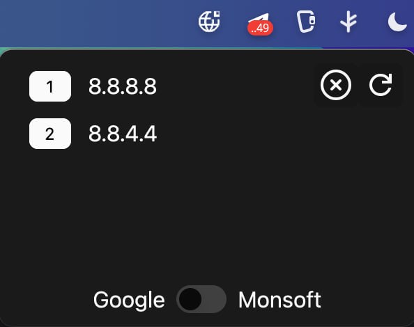

# DNS Switcher

A simple macOS application for quickly switching between different DNS servers through the system tray.


## Features

- **View Current DNS Servers** - Displays a list of active DNS servers
- **Quick DNS Switching** - Pre-configured setups for Google DNS and custom servers
- **Clear DNS Settings** - Reset to system default DNS settings
- **Refresh Information** - Get up-to-date information about current DNS servers
- **Tray Interface** - Runs in system tray for quick access

## Pre-configured DNS Providers

- **Google DNS**: `8.8.8.8`, `8.8.4.4`
- **Cloudflare**: `1.1.1.1`, `1.0.0.1`

## Installation & Build

### Requirements

- Rust (edition 2024)
- macOS (application uses macOS-specific APIs)

### Building from Source

#### Option 1: Build executable only
```bash
git clone https://github.com/qwxxx/dns_switcher
cd dns_switcher
cargo build --release
```

The built application will be located at `target/release/dns_switcher`.

#### Option 2: Create application bundle
##### Install cargo-bundle

First, install the `cargo-bundle` tool for creating distributable application bundles:

```bash
cargo install cargo-bundle
```

##### Building
```bash
git clone https://github.com/qwxxx/dns_switcher
cd dns_switcher
cargo bundle --release
```

This will create a proper macOS application bundle at `target/release/bundle/osx/DNS Switcher.app` that can be dragged to your Applications folder.

## Usage

1. Launch the application (either the executable or the .app bundle) - an icon will appear in the system tray
2. Click the tray icon to open the control window
3. Control buttons:
   - **Clear** - Reset DNS to system defaults
   - **Refresh** - Update the current DNS server list
   - **Toggle Switch** - Switch between Google DNS and custom dns list
